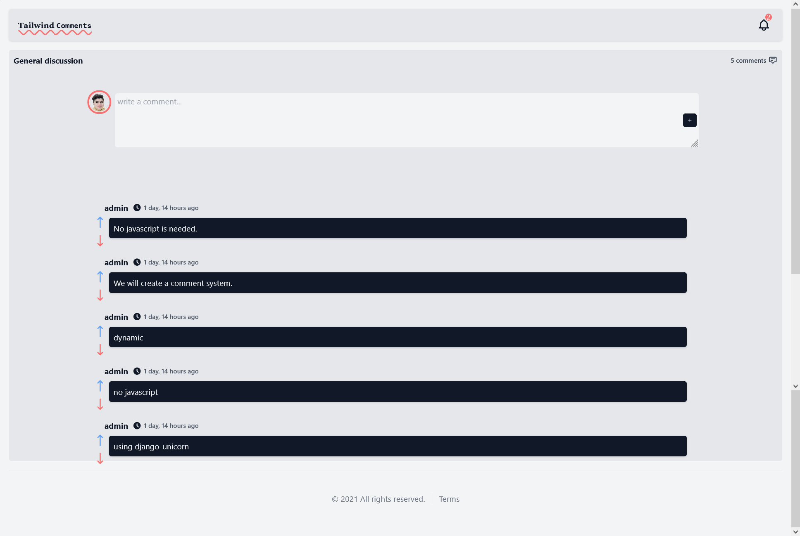

# Comments with Django Unicorn

This is a basic dynamic comment system where users can comment on posts or wherever you’ll implement this comment system without reloading the page, and we won’t use any javascript code. It will be a 100% Django dynamic comment system. 
This time we will use Django unicorn which is a great reactive component framework that makes AJAX requests in the background.

## Requirements

- Python version > 3.6
- virtualenv (pip install virtualenv)
- GIT

## How to clone and use it

```
git clone https://github.com/SelmiAbderrahim/comment-system-django-unicorn
cd comment-system-django-unicorn
virtualenv env
source env/bin/activate (Linux/Mac) | env\Scripts\activate (Windows)
python manage.py runserver
```

## The starting point

If you want to follow along with the turoial and to start from the beginning, after cloning the repo, change to the start commit

```
git checkout 3bc36525142a870c0d016a5b4c6b79ccff9a1257
```

## Screenshot



---

# Watch the tutorial on [YouTube](https://youtu.be/xPReGs1F8mk)
